# Quadruped Robot Locomotion
### The objective of this project was to analyse the different components of quadruped robot and to understand its locomotion and its variation based on kinematics analysis of quadruped robot in simulation. We have simulated different walking behaviors of a simple quadruped robot in MatLab to study the complexity in its physical implementation. Our design is rather primitive for the initial step to reduce the unnecessary complexity. The idea is to understand the various requirements and test the feasibility before we move to the physical model.  

## **Implementation Summary**
#### We have used a simulation-based approach to understand the working of quadruped robots. We imported our CAD models of the robot in a simulink module named Simscape multibody. Simulink generated a block diagram for the shared assembly and then we added actuation and sensing features in the revolute joint block of the block diagram. Control the joint with the PID controller. This constitutes the mechanical model of the quadruped robot. 
#### We carried out inverse kinematics calculation of the robot leg and the resulting calculations and equations are used to construct a simulink block named inverse kinematics. We replicated inverse kinematics blocks for all the four legs which had their own coordinate system. 
#### After that we selected an elliptical trajectory that each leg should follow in vertical plane order to take a step and derived a parametric equation of this elliptical trajectory and then modified it in such a way that with increasing time the points that are fed to the inverse kinematics are progressive in nature and results in taking the step of the leg.
#### Once inverse kinematics and trajectory planning blocks are set up we can control the phase and speed of each leg in order to simulate any kind of gait that it should perform in a given situation.

[Galloping Demo](results_and_screenshots/results/galloping.avi)   
[Trotting Demo](results_and_screenshots/results/trotting.avi)  
[Static Walking Demo](results_and_screenshots/results/static_walking.avi)

## **Tools Used**
- [SolidWorks 2013](https://www.solidworks.com/) 
- [Onshape](https://www.onshape.com/en/)
- [Matlab - Simulink (R2018a)](https://www.mathworks.com/products/matlab.html)

## **Computer Aided Design**
### We created two designs using solidworks and onshape one of which was used for testing and simulation while the other was used for 3D printing and prototype creation of the robot. The design that we used for the simulation is a simplified version of the actual design which both the designs have the same parameters like link length and co-ordinate system.
## **Design 1 (for prototype development)**
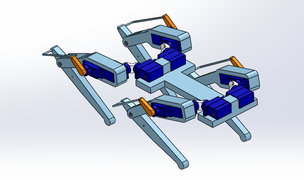

## **Derived Design for simulation**
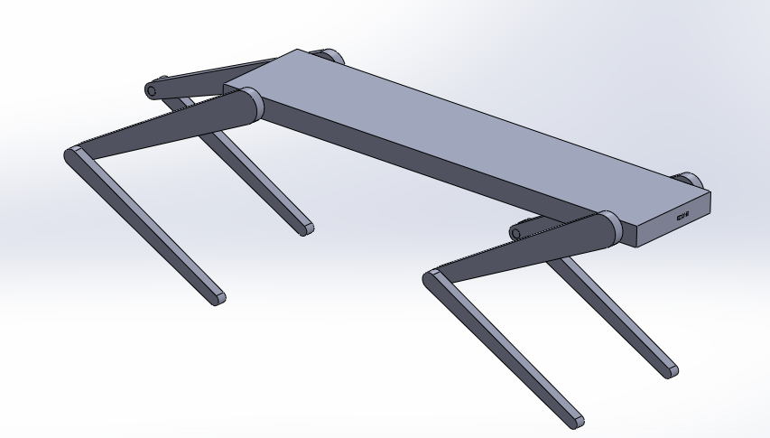

To import the CAD assembly in Simscape multibody execute the following command in the MatLab command window.
 >smimport(“Assembly.XML”);

### This will generate a simulink file Which will contain a connected block representing the original CAD assembly in form of block diagram. This block diagram consists of links connected by joints in this case we had only revolute joints.

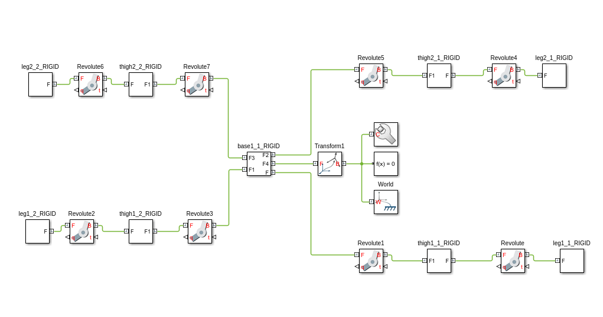

## Making Subsystems
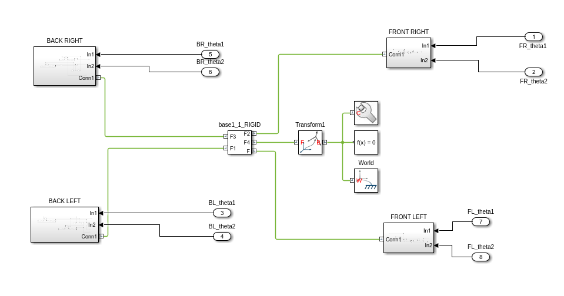

## Adding Joint Controls
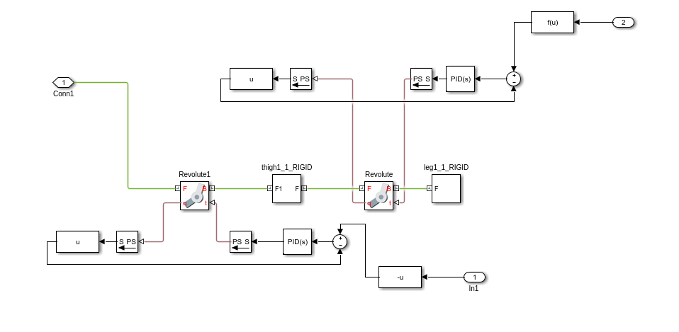

## Inverse Kinematics
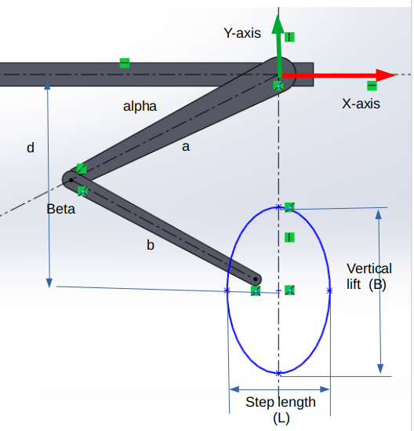

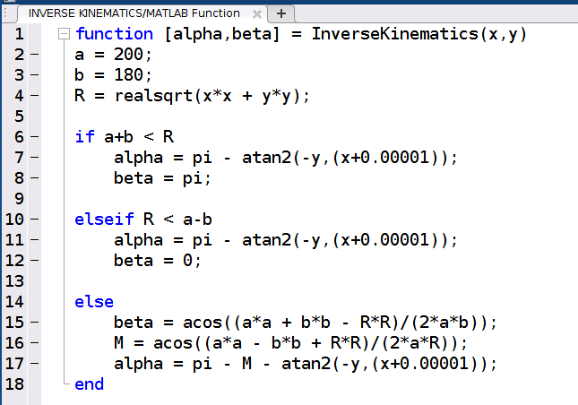

## **Trajectory Generation**
### the trajectory that we have chosen is an ellipse in the plane of robot leg motion which is in vertical plane. Now the variables of this ellipse are semi major axis and semi minor axis. These variables can be made a function of surface roughness and obstacles in the surface. In this way we can make it drive autonomously on slippery surfaces and surfaces with lots of pebbles and granules.
### We use the parametric equation of the ellipse and transform it such that with increasing time it outputs X and Y coordinates of the ellipse which when followed by the robot leg produces a forward moving step. Equations below show the X and Y coordinate of the ellipse and its dependence on the time.

### Elliptical parametric equation in terms of time t for x and y is:
X (θ) = (L/2) × c os(θ + π )  
Y (θ) = − B × s in(θ + π ) − d

### Where L = Step length and B = step height and θ = ωt + φ

### In the parameter θ to the above mentioned equations is given as:
θ = ω × t + φ  
### Where ω is the measure of how frequently trajectory planning blocks will give x,y commands to the inverse kinematics block. When ω is higher the robot leg will move faster it will take one step quicker than the other legs. φ is the phase difference between different legs.

## **Final Simulink Model**
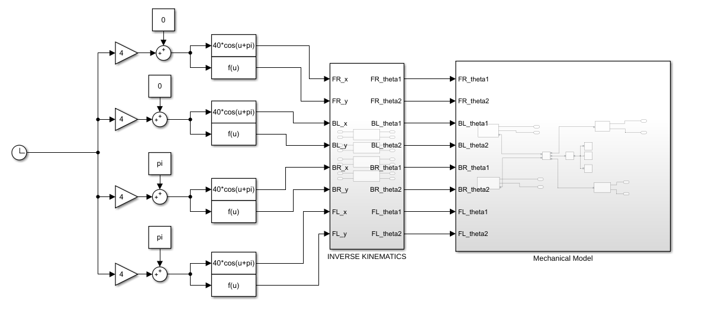

## **Simulating Different Gait**
#### Different Gaits can be simulated by changing the ω and φ parameters (discussed in previous section) of each leg.

### **Static Walking**
In static walking gait implementation the quadruped robot moves in such a way that
at any instant at least 3 legs are on the ground. In this configuration robot moves
one leg at a time and its centre of mass is located within the triangle formed by
joining the tips of the 3 legs that are on the ground. So it shifts its weight in the
triangle every time it takes a step.
Static walking gait is generally performed by four legged animals when they
maneuver over hard to walk surfaces like ice, rocky mountains.

### **Trotting**
Trotting gait is seen when a robot runs at a lower speed. In this at any instant less than 3 legs are on the ground. Generally in trotting gait implementation the diagonal legs of the robot move simultaneously. This comes under Dynamic gait because the motion is not stable if it is stopped. The center of mass of the robot is on the line joining the two diagonal legs. To implement trotting the phase difference between diagonal legs is set to 0 radians and the phase difference between the adjacent legs should be π radians.

### **Galloping**
In galloping cat implementation at any instant there are less than two legs on the ground. This makes it highly dynamic in nature and is most unstable. This is generally performed by quadruped animals when they are running very fast. We have simulated the most commonly observed galloping technique called rotary galloping. In rotary galloping the phase difference between all the four legs is π /2 radians. The order in which the legs take steps are circular in nature.

## **Results**
### **GAIT PATTERNS**
### **Static Walking**
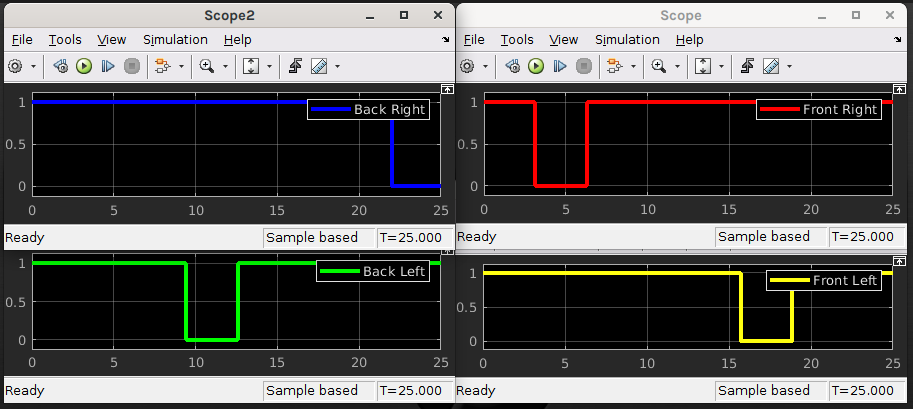
### **Trotting**
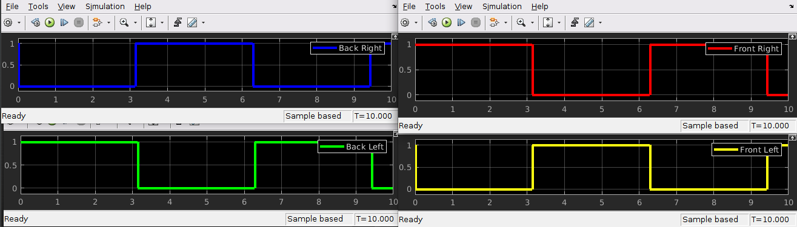
### **Galloping**
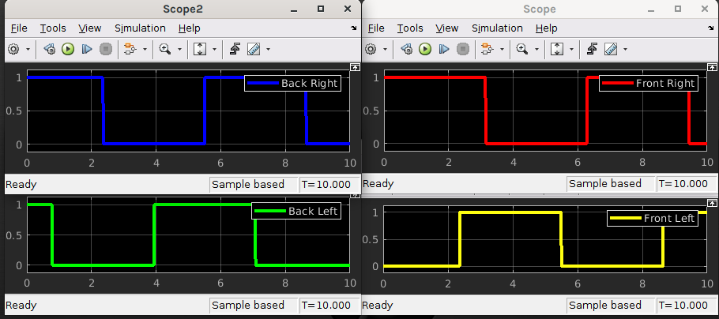

